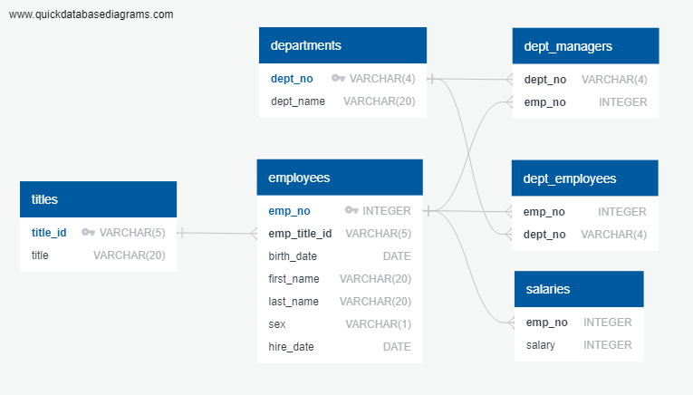

# Employee Database: A Mystery in Two Parts (SQL)

## Background 
This project involves conducting a research project on employees of the corporation from the 1980s and 1990s. All that remain of the database of employees from that period are six CSV files. The tables are designed to hold data in the CSVs which is then imported into a SQL database. In other words, the following are performed:
>   * Data Modeling
>   * Data Engineering
>   * Data Analysis

## Objectives 
### Data Modeling 


### Data Engineering 
* The information are used to create a table schema for each of the six CSV files. Data types, primary keys, foreign keys, and other constraints are specified.
* Each CSV file are imported into the corresponding SQL table.

```
- Data Engineering --
-- Drop Tables if Existing
--DROP TABLE IF EXISTS departments;
--DROP TABLE IF EXISTS dept_employees;
--DROP TABLE IF EXISTS dept_managers;
--DROP TABLE IF EXISTS employees;
--DROP TABLE IF EXISTS salaries;
--DROP TABLE IF EXISTS titles;

-- Exported from QuickDBD: https://www.quickdatabasediagrams.com/
-- Link to schema: https://app.quickdatabasediagrams.com/#/d/0JOpLb
-- NOTE! If you have used non-SQL datatypes in your design, you will have to change these here.


CREATE TABLE "departments" (
    "dept_no" VARCHAR(4)   NOT NULL,
    "dept_name" VARCHAR(20)   NOT NULL,
    CONSTRAINT "pk_departments" PRIMARY KEY (
        "dept_no"
     )
);

CREATE TABLE "dept_employees" (
    "emp_no" INTEGER   NOT NULL,
    "dept_no" VARCHAR(4)   NOT NULL
);

CREATE TABLE "dept_managers" (
    "dept_no" VARCHAR(4)   NOT NULL,
    "emp_no" INTEGER   NOT NULL
);

CREATE TABLE "employees" (
    "emp_no" INTEGER   NOT NULL,
    "emp_title_id" VARCHAR(5)   NOT NULL,
    "birth_date" DATE   NOT NULL,
    "first_name" VARCHAR(20)   NOT NULL,
    "last_name" VARCHAR(20)   NOT NULL,
    "sex" VARCHAR(1)   NOT NULL,
    "hire_date" DATE   NOT NULL,
    CONSTRAINT "pk_employees" PRIMARY KEY (
        "emp_no"
     )
);

CREATE TABLE "salaries" (
    "emp_no" INTEGER   NOT NULL,
    "salary" INTEGER   NOT NULL
);

CREATE TABLE "titles" (
    "title_id" VARCHAR(5)   NOT NULL,
    "title" VARCHAR(20)   NOT NULL,
    CONSTRAINT "pk_titles" PRIMARY KEY (
        "title_id"
     )
);

ALTER TABLE "dept_employees" ADD CONSTRAINT "fk_dept_employees_emp_no" FOREIGN KEY("emp_no")
REFERENCES "employees" ("emp_no");

ALTER TABLE "dept_employees" ADD CONSTRAINT "fk_dept_employees_dept_no" FOREIGN KEY("dept_no")
REFERENCES "departments" ("dept_no");

ALTER TABLE "dept_managers" ADD CONSTRAINT "fk_dept_managers_dept_no" FOREIGN KEY("dept_no")
REFERENCES "departments" ("dept_no");

ALTER TABLE "dept_managers" ADD CONSTRAINT "fk_dept_managers_emp_no" FOREIGN KEY("emp_no")
REFERENCES "employees" ("emp_no");

ALTER TABLE "employees" ADD CONSTRAINT "fk_employees_emp_title_id" FOREIGN KEY("emp_title_id")
REFERENCES "titles" ("title_id");

ALTER TABLE "salaries" ADD CONSTRAINT "fk_salaries_emp_no" FOREIGN KEY("emp_no")
REFERENCES "employees" ("emp_no");


-- Query * FROM Each Table To Confirm Data Is Correct
SELECT * FROM "titles"; 
SELECT * FROM "employees"; 
SELECT * FROM "salaries"; 
SELECT * FROM "departments"; 
SELECT * FROM "dept_employees"; 
SELECT * FROM "dept_managers"; 
```

### Data Analysis

1. List the following details of each employee: employee number, last name, first name, sex, and salary.
```
SELECT employees.emp_no, employees.last_name,employees.first_name,employees.sex, salaries.salary
	FROM employees
	JOIN salaries ON employees.emp_no = salaries.emp_no;
```

2. List first name, last name, and hire date for employees who were hired in 1986.
```
SELECT first_name, last_name, hire_date
	FROM employees
	WHERE extract(year from hire_date) = 1986;
```

3. List the manager of each department with the following information: department number, department name, the manager's employee number, last name, first name.
```
SELECT departments.dept_no, departments.dept_name,dept_managers.emp_no, 
		employees.last_name, employees.first_name 
	FROM departments 
	INNER JOIN dept_managers ON departments.dept_no=dept_managers.dept_no
	INNER JOIN employees ON dept_managers.emp_no=employees.emp_no; 
```

4. List the department of each employee with the following information: employee number, last name, first name, and department name.
```
SELECT employees.emp_no, employees.last_name, employees.first_name, departments.dept_name
	FROM employees 
	INNER JOIN dept_employees ON employees.emp_no=dept_employees.emp_no
	INNER JOIN departments ON departments.dept_no=dept_employees.dept_no; 
```

5. List first name, last name, and sex for employees whose first name is "Hercules" and last names begin with "B."
```
SELECT first_name, last_name, sex
	FROM employees 
	WHERE first_name='Hercules' AND last_name LIKE 'B%'; 
```

6. List all employees in the Sales department, including their employee number, last name, first name, and department name.
```
SELECT employees.emp_no, employees.first_name, employees.last_name, departments.dept_name
	FROM employees
	INNER JOIN dept_employees ON dept_employees.emp_no=employees.emp_no
	INNER JOIN departments ON departments.dept_no=dept_employees.dept_no
	WHERE dept_name = 'Sales'; 
```

7. List all employees in the Sales and Development departments, including their employee number, last name, first name, and department name.
```
SELECT employees.emp_no, employees.last_name, employees.first_name, departments.dept_name
	FROM employees
	INNER JOIN dept_employees ON dept_employees.emp_no=employees.emp_no
	INNER JOIN departments ON departments.dept_no=dept_employees.dept_no
	WHERE dept_name = 'Sales' OR dept_name ='Development'; 
```

8. In descending order, list the frequency count of employee last names, i.e., how many employees share each last name.
```
SELECT last_name, COUNT(first_name) AS "last_name_count"
	FROM employees
	GROUP BY last_name
	ORDER BY "last_name_count" DESC;
```
